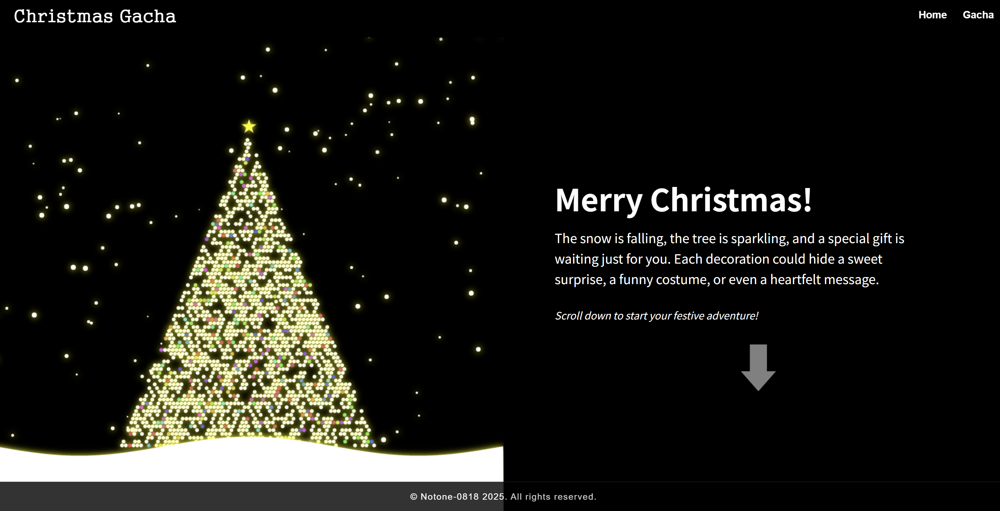

# 🎄 Christmas Gacha

A personal, interactive Christmas experience built with code — not design tools.

This project was created as a one-time Christmas gift for a single person. ❤️  
It is not a public service, not a commercial product, and not meant to scale.

Just a small world made with care.

---

## ✨ Concept

Christmas Gacha is an interactive web experience where a user:

1. Enters a calm Christmas landing scene
2. Chooses a “fate card” with fixed probabilities
3. Starts a gacha animation filled with suspense
4. Receives a final gift result with a visual reveal

The focus is not efficiency or monetization —  
it’s **emotion, anticipation, and surprise**.

---

## 🎁 Features

- Custom **Canvas-based Christmas tree**
  - Snowfall animation
  - Dot-based tree structure
  - Star and decorative lights
- Fixed-probability **Gacha system**
  - Sweets / Costume / Message / Mystery
- Animated gacha sequence
  - Shaking phase
  - Reveal phase with visual feedback
- Minimal UI with dark, winter-themed aesthetics
- Built entirely without design tools (no Figma, no templates)

---

## 🛠 Tech & Skills

- **React**
  - Component-driven architecture
  - State-based animation flow
- **Canvas API**
  - Custom graphics (tree, snow, decorations)
- **Animation Design**
  - Shake / reveal timing
  - Easing and visual suspense
- **Probability-based Logic**
  - Fixed gacha odds
  - Deterministic result mapping
- **UI/UX Flow Design**
  - Emotional pacing over technical complexity

---

## 🚫 What This Project Is Not

- No backend
- No authentication
- No deployment
- No analytics
- No optimization for scale

This is intentional.

---

## 🎯 Why This Project Exists

This project exists because:

- I wanted to create something **by hand**
- I wanted to explore **visual expression through code**
- I wanted to make a Christmas gift that couldn’t be bought or copied

The value of this project is not in how many users it has,  
but **who it was made for**.

---

## 📽 Demo

Click the image to watch the demo video.

---

## 📌 Notes

This project will not be maintained after Christmas.  
It is meant to live as a moment, not a product.

---

**Made with care, code, and winter nights.**  
© 2025
